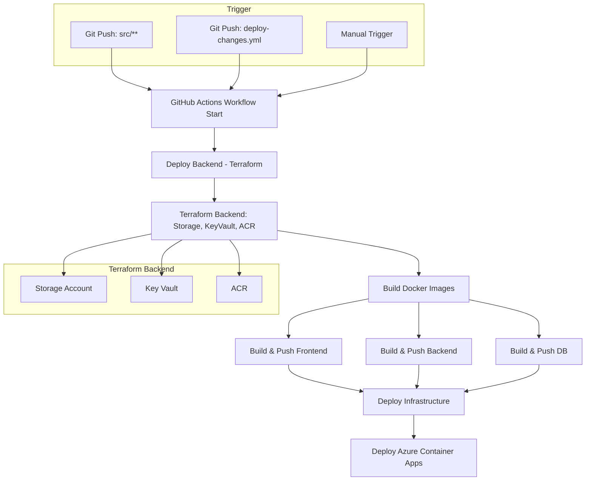
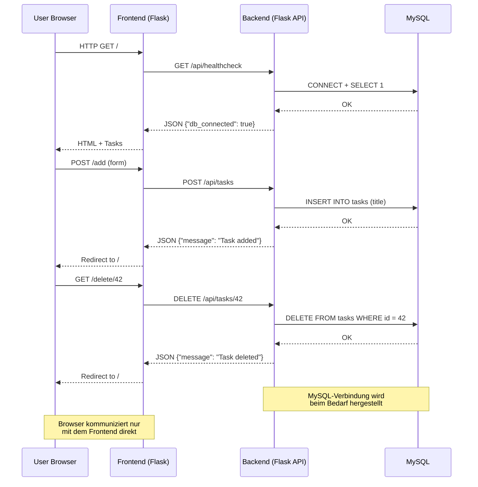

# Modul 300 - Plattformübergreifende Dienste in ein Netzwerk integrieren

## Inhaltsverzeichnis

1. [Modul 300 - Plattformübergreifende Dienste in ein Netzwerk integrieren](#modul-300---plattformübergreifende-dienste-in-ein-netzwerk-integrieren)
   1. [Inhaltsverzeichnis](#inhaltsverzeichnis)
   2. [Projektübersicht](#projektübersicht)
   3. [Anforderungsanalyse und Technologie-Entscheidungen](#anforderungsanalyse-und-technologie-entscheidungen)
      1. [Bedarfserhebung](#bedarfserhebung)
      2. [Technologie-Begründungen](#technologie-begründungen)
   4. [Systemarchitektur](#systemarchitektur)
      1. [Microservices-Design](#microservices-design)
      2. [Technologie-Stack](#technologie-stack)
   5. [Integrationskonzept](#integrationskonzept)
      1. [Netzwerkdesign](#netzwerkdesign)
      2. [Werkzeuge und Entwicklung](#werkzeuge-und-entwicklung)
      3. [Testkonzept](#testkonzept)
   6. [Konfiguration und Monitoring](#konfiguration-und-monitoring)
      1. [Secrets Management](#secrets-management)
      2. [Service-Optimierung](#service-optimierung)
      3. [Konfigurationsmanagement](#konfigurationsmanagement)
      4. [Datenmigration und Changemanagement](#datenmigration-und-changemanagement)
   7. [Netzwerkkonfiguration](#netzwerkkonfiguration)
      1. [Azure Container Apps Networking](#azure-container-apps-networking)
      2. [Service Connectivity](#service-connectivity)
      3. [Netzwerk-Segmentierung](#netzwerk-segmentierung)
      4. [Konnektivitätstests](#konnektivitätstests)
   8. [Service Integration](#service-integration)
      1. [Microservices-Architektur](#microservices-architektur)
      2. [API-Schnittstellen](#api-schnittstellen)
      3. [CI/CD-Pipeline](#cicd-pipeline)
   9. [Betrieb und Überwachung](#betrieb-und-überwachung)
      1. [Monitoring-Setup](#monitoring-setup)
      2. [Alerting](#alerting)
      3. [Wartung und Updates](#wartung-und-updates)
      4. [Hochverfügbarkeit](#hochverfügbarkeit)
      5. [Backup und Disaster Recovery](#backup-und-disaster-recovery)
   10. [Fehleranalyse](#fehleranalyse)
       1. [Logging-Strategie](#logging-strategie)
       2. [Systematische Fehlerbehandlung](#systematische-fehlerbehandlung)
       3. [Monitoring und Alerting](#monitoring-und-alerting)
   11. [Deployment](#deployment)
       1. [Automatisches Deployment](#automatisches-deployment)
       2. [Manuelle Entwicklung](#manuelle-entwicklung)
       3. [Live-System](#live-system)
   12. [Sicherheitskonzept](#sicherheitskonzept)
       1. [Secrets Management](#secrets-management-1)
       2. [Network Security](#network-security)
       3. [Access Control](#access-control)
   13. [Systemvisualisierung](#systemvisualisierung)
       1. [Netzwerkarchitektur](#netzwerkarchitektur)
       2. [Datenfluss](#datenfluss)
       3. [CI/CD Pipeline Prozess](#cicd-pipeline-prozess)
       4. [Rollenkonzept](#rollenkonzept)

## Projektübersicht
Eine containerisierte Todo-Anwendung mit 3-Tier-Architektur, deployed auf Azure Container Apps mit vollständiger CI/CD-Pipeline.

## Anforderungsanalyse und Technologie-Entscheidungen

### Bedarfserhebung
Das Projekt erforderte eine skalierbare, cloud-native Lösung mit folgenden Anforderungen:
- **Microservices-Architektur** für bessere Wartbarkeit und Skalierung
- **Containerisierung** für konsistente Deployments
- **Infrastructure as Code** für reproduzierbare Umgebungen
- **Automatisierte CI/CD** für schnelle Releases

### Technologie-Begründungen
- **Python Flask**: Lightweight Framework, ideal für Microservices und schnelle Entwicklung
- **Azure Container Apps**: Serverless Container Platform - einfacher als AKS, managed Kubernetes
- **Terraform**: Deklarative IaC, bessere State-Verwaltung als ARM Templates
- **MySQL**: Bewährte relationale Datenbank, einfache Container-Integration
- **GitHub Actions**: Native Git-Integration, kostenlos für öffentliche Repos

---

## Systemarchitektur

### Microservices-Design
- **Frontend**: Python Flask Web-Interface (Port 8080)
- **Backend**: Python Flask REST API (Port 5000)
- **Database**: MySQL Container (Port 3306)

### Technologie-Stack
- **Container**: Docker & Docker Compose
- **Orchestrierung**: Azure Container Apps
- **Infrastructure as Code**: Terraform
- **CI/CD**: GitHub Actions
- **Cloud Provider**: Microsoft Azure
- **Container Registry**: Azure Container Registry (ACR)

---

## Integrationskonzept

### Netzwerkdesign
- Container-zu-Container Kommunikation über interne Netzwerke
- Externe Erreichbarkeit nur für Frontend
- Service Discovery über Container-Namen

### Werkzeuge und Entwicklung
- **Docker**: Containerisierung aller Services
- **Terraform**: Infrastructure as Code für Azure Resources
- **GitHub Actions**: Automatisierte Build- und Deployment-Pipeline

### Testkonzept
- **Infrastructure Tests**: `terraform validate` und `terraform plan` in CI/CD
- **Integration Tests**: Terraform Import-Tests für bestehende Ressourcen
- **Health-Check Endpoints**: `/api/healthcheck` für Service-Verfügbarkeit
- **Container Build Tests**: Automatisierte Docker-Builds validieren Images
- **Deployment Tests**: Retry-Mechanismen testen Service-Verbindungen

---

## Konfiguration und Monitoring

### Secrets Management
- Azure Key Vault für sensitive Daten (DB-Passwörter, ACR-Credentials)
- Environment Variables für Container-Konfiguration
- Trennung von Secrets und Code

### Service-Optimierung
- **Performance**: Container Resource Limits (0.5 CPU, 1Gi Memory)
- **Sicherheit**: Private Container Networks, Managed Identities
- **Ressourcenverbrauch**: Effiziente Base Images (python:3.11-slim)

### Konfigurationsmanagement
- Zentrale Variablen in terraform.tfvars
- Umgebungsprofile für verschiedene Deployment-Stages
- Automatische Secret-Injection aus Key Vault

### Datenmigration und Changemanagement
- **Database Initialization**: Automatische Schema-Erstellung via `init.sql`
- **Container Image Versioning**: Tags für verschiedene Releases
- **Infrastructure Drift Detection**: Terraform Plan vor jedem Apply
- **Rollback-Mechanismus**: Previous Container Images verfügbar in ACR

---

## Netzwerkkonfiguration

### Azure Container Apps Networking
- **Container App Environment**: Gemeinsame Netzwerkumgebung für alle Services
- **Internal Communication**: Service-zu-Service über Container-Namen
- **External Access**: Nur Frontend mit `external_enabled = true`

### Service Connectivity
```hcl
# Frontend Ingress (extern erreichbar)
ingress {
  external_enabled = true
  target_port      = 8080
  transport        = "auto"
}

# Backend Ingress (nur intern)
ingress {
  external_enabled = false
  target_port      = 5000
  transport        = "tcp"
}

# Database Ingress (nur intern)
ingress {
  external_enabled = false
  target_port      = 3306
  transport        = "tcp"
}
```

### Netzwerk-Segmentierung
- **Frontend** → **Backend**: HTTP Kommunikation über `${var.project_name}-backend`
- **Backend** → **Database**: MySQL Verbindung über `${var.project_name}-db`
- **Externe Zugriffe**: Nur Frontend über Azure Container Apps Ingress

### Konnektivitätstests
- Health-Check Endpoints (`/api/healthcheck`)
- Automatische Retry-Mechanismen bei Verbindungsfehlern
- Service Dependencies durch Terraform `depends_on`

---

## Service Integration

### Microservices-Architektur
- **Kapselung**: Jeder Service in separatem Container
- **API-Design**: REST API mit JSON-Kommunikation
- **Service Discovery**: Container-Namen als Hostnames

### API-Schnittstellen
```
GET  /api/tasks          - Alle Tasks abrufen
POST /api/tasks          - Neue Task erstellen
DELETE /api/tasks/<id>   - Task löschen
GET  /api/healthcheck    - Service Health Status
```

### CI/CD-Pipeline
- **Trigger**: Push auf main branch
- **Build**: Parallele Container-Builds für alle Services
- **Deploy**: Terraform Apply für Infrastructure Updates
- **Stages**: Backend → Build → Infrastructure Deployment

---

## Betrieb und Überwachung

### Monitoring-Setup
- **Azure Application Insights**: Application Performance Monitoring
- **Log Analytics Workspace**: Centralized Logging
- **Container Health**: Built-in Container Apps Monitoring

### Alerting
- Backend Health Monitoring (Replica Count < 1)
- Frontend Error Rate Monitoring (5xx Responses > 100)
- Email-Benachrichtigungen an Admin

### Wartung und Updates
- **Rolling Updates**: Zero-Downtime Deployments
- **Automated Rollbacks**: Bei fehlgeschlagenen Deployments
- **Container Registry**: Versionierte Images

### Hochverfügbarkeit
- **Auto-Scaling**: Container Apps Auto-Scaling bei Last
- **Health Checks**: Automatische Container-Restarts
- **Multi-AZ**: Azure Container Apps Multi-Zone Deployment

### Backup und Disaster Recovery
- **Container Images**: Persistent in Azure Container Registry
- **Infrastructure State**: Terraform State in Azure Storage Account
- **Database Persistence**: Volume Mounts für MySQL Data
- **Configuration Backup**: Secrets gesichert in Azure Key Vault
- **Code Repository**: Git als Backup für alle Konfigurationen

---

## Fehleranalyse

### Logging-Strategie
```python
logging.basicConfig(
    level=logging.INFO,
    format='%(asctime)s [%(levelname)s] %(message)s'
)
```

### Systematische Fehlerbehandlung
- **Kategorisierung**: Connection Errors, Application Errors, Infrastructure Errors
- **Retry-Mechanismen**: Automatische Wiederholung bei temporären Fehlern
- **Graceful Degradation**: Frontend funktioniert auch bei Backend-Ausfällen

### Monitoring und Alerting
- Container-Level Monitoring über Azure Monitor
- Application-Level Logging über Python Logging
- Database Connection Monitoring mit Health Checks

---

## Deployment

### Automatisches Deployment
```bash
git push origin main
# Triggert automatisch:
# 1. Terraform Backend Deployment
# 2. Container Image Builds
# 3. Infrastructure Deployment
```

### Manuelle Entwicklung
```bash
cd src/docker
docker-compose up -d
# Lokale Entwicklung auf http://localhost:8080
```

### Live-System
Nach erfolgreichem Deployment ist die Anwendung unter der Frontend-URL verfügbar (wird in Terraform Outputs angezeigt).

## Sicherheitskonzept

### Secrets Management
- Alle Passwörter und Credentials in Azure Key Vault
- Managed Identities für Service-zu-Service Authentifizierung
- Keine Secrets in Code oder Konfigurationsdateien

### Network Security
- Private Container Networks
- Nur Frontend extern erreichbar
- ACR-Authentication für Container Image Pulls

### Access Control
- Azure RBAC für Resource-Zugriff
- Service Principals für CI/CD
- Least-Privilege Prinzip für alle Identities

## Systemvisualisierung

### Netzwerkarchitektur


### Datenfluss
```
User Request → Frontend (Flask) → Backend API → MySQL Database
User Response ← Frontend (HTML) ← Backend (JSON) ← Database Query
```

### CI/CD Pipeline Prozess


### Rollenkonzept
- **Developer**: Code Push, lokale Entwicklung mit Docker Compose
- **CI/CD Pipeline**: Automated Deployment mit Service Principal
- **Admin**: Azure Resource Management, Key Vault Access
- **End User**: Frontend Access über öffentliche URL



