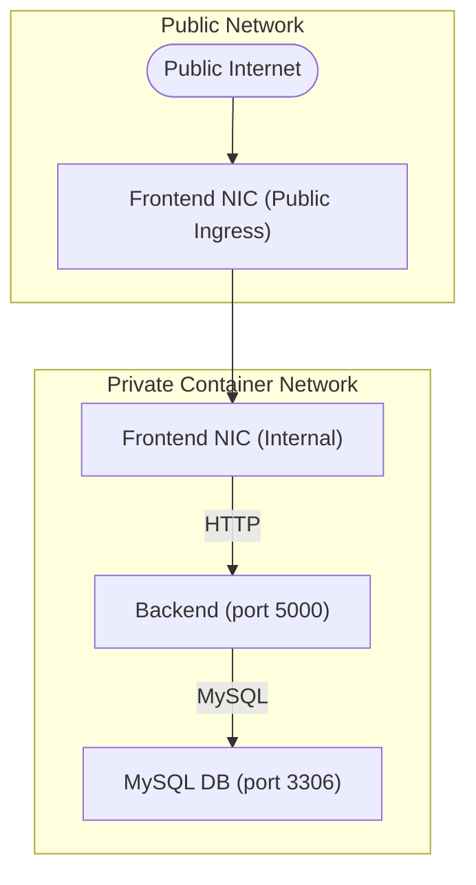
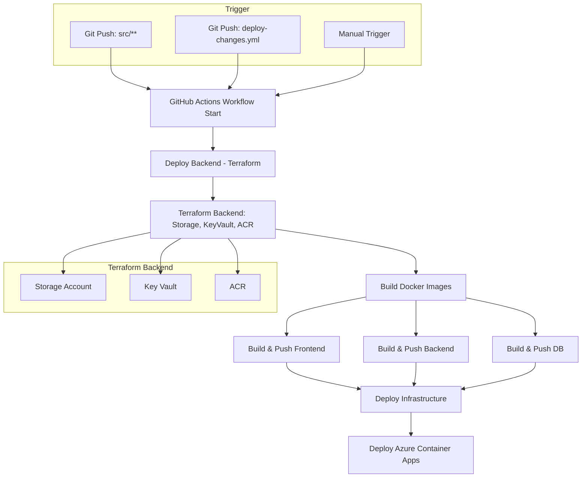
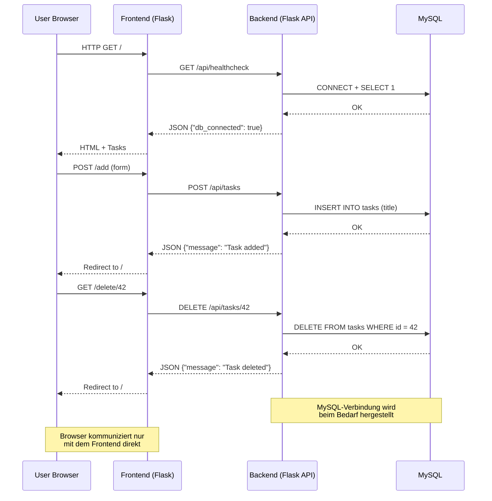

# Modul 300 - Plattformübergreifende Dienste in ein Netzwerk integrieren

## Inhaltsverzeichnis

1. [Modul 300 - Plattformübergreifende Dienste in ein Netzwerk integrieren](#modul-300---plattformübergreifende-dienste-in-ein-netzwerk-integrieren)
   1. [Inhaltsverzeichnis](#inhaltsverzeichnis)
2. [1. Projektbeschreibung und Ziel](#1-projektbeschreibung-und-ziel)
   1. [1.1 Technische Anforderungen](#11-technische-anforderungen)
   2. [1.2 Wichtige technische Aspekte](#12-wichtige-technische-aspekte)
      1. [1.2.1 Effizienz (Rechenleistung und Kosten)](#121-effizienz-rechenleistung-und-kosten)
      2. [1.2.2 Sicherheit](#122-sicherheit)
      3. [1.2.3 Flexibilität](#123-flexibilität)
   3. [1.3 Auswahl der Technologien und Gründe](#13-auswahl-der-technologien-und-gründe)
      1. [1.3.1 Container-Plattform](#131-container-plattform)
      2. [1.3.2 Infrastructure as Code](#132-infrastructure-as-code)
      3. [1.3.3 Web-Framework](#133-web-framework)
      4. [1.3.4 Datenbank](#134-datenbank)
      5. [1.3.5 CI/CD-System](#135-cicd-system)
      6. [1.3.6 Container Registry](#136-container-registry)
      7. [1.3.7 Secrets Management](#137-secrets-management)
   4. [1.4 Wirtschaftliche Überlegungen](#14-wirtschaftliche-überlegungen)
   5. [1.5 Auswahl des Cloud-Anbieters](#15-auswahl-des-cloud-anbieters)
   6. [1.6 Unterschiede zwischen IaC und Konfigurationsmanagement](#16-unterschiede-zwischen-iac-und-konfigurationsmanagement)
   7. [2. Integrationskonzept \& Planung](#2-integrationskonzept--planung)
      1. [2.1 Systemarchitektur](#21-systemarchitektur)
         1. [2.1.1 Microservices-Design](#211-microservices-design)
         2. [2.1.2 Technologie-Stack](#212-technologie-stack)
      2. [2.2 Netzwerkdesign](#22-netzwerkdesign)
      3. [2.3 Werkzeuge und Entwicklung](#23-werkzeuge-und-entwicklung)
      4. [2.4 Testkonzept](#24-testkonzept)
         1. [2.4.1 Infrastructure Tests](#241-infrastructure-tests)
         2. [2.4.2 Application Tests](#242-application-tests)
   8. [3. Konfiguration und Monitoring](#3-konfiguration-und-monitoring)
      1. [3.1 Secrets Management](#31-secrets-management)
      2. [3.2 Service-Optimierung](#32-service-optimierung)
         1. [3.2.1 Performance](#321-performance)
         2. [3.2.2 Sicherheit](#322-sicherheit)
         3. [3.2.3 Ressourcenverbrauch](#323-ressourcenverbrauch)
      3. [3.3 Konfigurationsmanagement](#33-konfigurationsmanagement)
      4. [3.4 Datenmigration und Changemanagement](#34-datenmigration-und-changemanagement)
         1. [3.4.1 Database Initialization](#341-database-initialization)
         2. [3.4.2 Version Control](#342-version-control)
         3. [3.4.3 Rollback-Mechanismus](#343-rollback-mechanismus)
   9. [4. Netzwerkkonfiguration](#4-netzwerkkonfiguration)
      1. [4.1 Azure Container Apps Networking](#41-azure-container-apps-networking)
      2. [4.2 Service Connectivity](#42-service-connectivity)
         1. [4.2.1 Frontend Ingress (extern erreichbar)](#421-frontend-ingress-extern-erreichbar)
         2. [4.2.2 Backend Ingress (nur intern)](#422-backend-ingress-nur-intern)
         3. [4.2.3 Database Ingress (nur intern)](#423-database-ingress-nur-intern)
      3. [4.3 Netzwerk-Segmentierung](#43-netzwerk-segmentierung)
      4. [4.4 Konnektivitätstests](#44-konnektivitätstests)
   10. [5. Service Integration](#5-service-integration)
       1. [5.1 Microservices-Architektur](#51-microservices-architektur)
       2. [5.2 API-Schnittstellen](#52-api-schnittstellen)
       3. [5.3 CI/CD-Pipeline](#53-cicd-pipeline)
          1. [5.3.1 Pipeline Stages](#531-pipeline-stages)
   11. [6. Betrieb und Überwachung](#6-betrieb-und-überwachung)
       1. [6.1 Monitoring-Setup](#61-monitoring-setup)
       2. [6.2 Alerting](#62-alerting)
       3. [6.3 Wartung und Updates](#63-wartung-und-updates)
       4. [6.4 Hochverfügbarkeit](#64-hochverfügbarkeit)
       5. [6.5 Backup und Disaster Recovery](#65-backup-und-disaster-recovery)
   12. [7. Fehleranalyse \& Troubleshooting](#7-fehleranalyse--troubleshooting)
       1. [7.1 Logging-Strategie](#71-logging-strategie)
       2. [7.2 Systematische Fehlerbehandlung](#72-systematische-fehlerbehandlung)
          1. [7.2.1 Kategorisierung](#721-kategorisierung)
          2. [7.2.2 Retry-Mechanismen](#722-retry-mechanismen)
          3. [7.2.3 Graceful Degradation](#723-graceful-degradation)
       3. [7.3 Monitoring und Alerting](#73-monitoring-und-alerting)
   13. [8. Deployment](#8-deployment)
       1. [8.1 Automatisches Deployment](#81-automatisches-deployment)
       2. [8.2 Manuelle Entwicklung](#82-manuelle-entwicklung)
       3. [8.3 Live-System](#83-live-system)
   14. [9. Sicherheitskonzept](#9-sicherheitskonzept)
       1. [9.1 Secrets Management](#91-secrets-management)
       2. [9.2 Network Security](#92-network-security)
       3. [9.3 Access Control](#93-access-control)
   15. [10. Systemvisualisierung](#10-systemvisualisierung)
       1. [10.1 Netzwerkarchitektur](#101-netzwerkarchitektur)
       2. [10.2 CI/CD Pipeline Prozess](#102-cicd-pipeline-prozess)
       3. [10.3 Datenfluss und API-Kommunikation](#103-datenfluss-und-api-kommunikation)
       4. [10.4 Rollenkonzept](#104-rollenkonzept)

# 1. Projektbeschreibung und Ziel

Das Projekt ist eine containerisierte Todo-Anwendung mit einer 3-Tier-Architektur. Die Anwendung wird mit Azure Container Apps betrieben. Eine CI/CD-Pipeline sorgt für die automatische Bereitstellung. Die Infrastruktur wird mit Terraform als Code beschrieben.

## 1.1 Technische Anforderungen

Die Anwendung verwendet eine Microservices-Architektur, um einzelne Teile getrennt entwickeln und betreiben zu können. Container sorgen für einheitliche Umgebungen. Die Infrastruktur wird automatisiert aufgebaut. Neue Versionen der Anwendung werden nach jedem Git-Push oder durch manuelles Auslösen automatisch veröffentlicht.

## 1.2 Wichtige technische Aspekte

### 1.2.1 Effizienz (Rechenleistung und Kosten)

Die Container haben feste CPU- und Speichergrenzen (z. B. 0.5 CPU, 1 Gi RAM). Es werden schlanke Container-Images verwendet (z. B. `python:3.11-slim`). Azure Container Apps nutzt ein nutzungsbasiertes Abrechnungsmodell. In unserem Fall läuft die Anwendung rund um die Uhr, daher wurden die Container so effizient wie möglich gebaut.

### 1.2.2 Sicherheit

Zugangsdaten und andere sensible Informationen werden im Azure Key Vault gespeichert. Die Container befinden sich in privaten Netzwerken. Dienste authentifizieren sich über verwaltete Identitäten. Berechtigungen werden nach dem Least-Privilege-Prinzip vergeben. Zusätzlich werden Secrets auch in GitHub gespeichert und über die CI/CD-Pipeline verteilt.

### 1.2.3 Flexibilität

Die Infrastruktur wird mit Terraform als Code beschrieben. Dadurch ist sie leicht anpassbar und wiederverwendbar. Durch Containerisierung ist die Anwendung nicht an eine bestimmte Umgebung gebunden. Es werden mehrere Umgebungen wie Test und Produktion unterstützt.

## 1.3 Auswahl der Technologien und Gründe

### 1.3.1 Container-Plattform

**Ausgewählt**: Azure Container Apps
**Alternativen**: Azure Kubernetes Service (AKS), Azure Container Instances (ACI)
**Gründe**: Keine Cluster-Verwaltung notwendig. Automatisches Skalieren ist eingebaut. Abrechnung nur bei aktiver Nutzung.

### 1.3.2 Infrastructure as Code

**Ausgewählt**: Terraform
**Alternativen**: ARM Templates, Azure Bicep
**Gründe**: Plattformunabhängig. Infrastruktur-Zustand wird gespeichert. Klare Syntax. Module wiederverwendbar. Große Community.

### 1.3.3 Web-Framework

**Ausgewählt**: Python Flask
**Alternativen**: Node.js Express
**Gründe**: Leichtgewichtig. Schneller Einstieg. Gute Container-Kompatibilität. Große Bibliotheksauswahl.

### 1.3.4 Datenbank

**Ausgewählt**: MySQL
**Alternativen**: PostgreSQL, Azure SQL
**Gründe**: Weit verbreitet. Gute Docker-Integration. Ausreichend für CRUD-Anwendungen. Open Source. Einfach lokal nutzbar.

### 1.3.5 CI/CD-System

**Ausgewählt**: GitHub Actions
**Alternativen**: Azure DevOps
**Gründe**: Direkte GitHub-Integration. YAML-basierte Workflows. Gute Azure-Kompatibilität. Viele fertige Actions verfügbar.

### 1.3.6 Container Registry

**Ausgewählt**: Azure Container Registry
**Alternativen**: Docker Hub, GitHub Container Registry, AWS ECR
**Gründe**: Gut in Azure integriert. Zugriff über Azure AD steuerbar. Keine eigene Infrastruktur nötig. Gute Performance.

### 1.3.7 Secrets Management

**Ausgewählt**: Azure Key Vault
**Alternativen**: HashiCorp Vault, Kubernetes Secrets, Umgebungsvariablen
**Gründe**: Unterstützt Sicherheitsstandards. Schlüssel sind hardwaregesichert. Gute Azure-Integration. Protokollierung vorhanden. Kein eigener Betrieb notwendig.

## 1.4 Wirtschaftliche Überlegungen

Die Anwendung nutzt Dienste mit nutzungsbasierter Abrechnung. Der Betrieb ist dadurch kosteneffizient, besonders bei geringer Last. Automatisches Skalieren verhindert Überbereitstellung. Durch Managed Services ist weniger Wartung nötig. Die Architektur ist einfach gehalten, was Schulungs- und Verwaltungsaufwand reduziert.

## 1.5 Auswahl des Cloud-Anbieters

**Ausgewählt**: Microsoft Azure
**Alternativen**: AWS, Google Cloud
**Gründe**: Es wurde bewusst ein anderer Anbieter als AWS gewählt. Azure bietet moderne Dienste wie Container Apps. Gute Integration mit Microsoft-Produkten. Azure-Kenntnisse ergänzen vorhandenes Wissen.

## 1.6 Unterschiede zwischen IaC und Konfigurationsmanagement

**Ausgewählt**: Terraform
**Alternativen**: Ansible
**Gründe**: Terraform stellt Infrastruktur bereit („Was wird erstellt?“), während Tools wie Ansible Konfiguration übernehmen („Wie wird es eingerichtet?“). Terraform arbeitet deklarativ, erkennt Zustandsänderungen und zeigt geplante Änderungen vorab an.

---

## 2. Integrationskonzept & Planung

### 2.1 Systemarchitektur

#### 2.1.1 Microservices-Design
- **Frontend**: Python Flask Web-Interface (Port 8080)
- **Backend**: Python Flask REST API (Port 5000)
- **Database**: MySQL Container (Port 3306)

#### 2.1.2 Technologie-Stack
- **Container**: Docker & Docker Compose
- **Orchestrierung**: Azure Container Apps
- **Infrastructure as Code**: Terraform
- **CI/CD**: GitHub Actions
- **Cloud Provider**: Microsoft Azure
- **Container Registry**: Azure Container Registry (ACR)

### 2.2 Netzwerkdesign
- Container-zu-Container Kommunikation über interne Netzwerke
- Externe Erreichbarkeit nur für Frontend
- Service Discovery über Container-Namen

### 2.3 Werkzeuge und Entwicklung
- **Docker**: Containerisierung aller Services ([Dockerfiles](src/docker/))
- **Terraform**: Infrastructure as Code für Azure Resources ([Infrastructure](src/terraform/infrastructure/), [Storage](src/terraform/storage/))
- **GitHub Actions**: Automatisierte Build- und Deployment-Pipeline ([Workflow](/.github/workflows/deploy-changes.yml))

### 2.4 Testkonzept

#### 2.4.1 Infrastructure Tests
- `terraform validate` und `terraform plan` in CI/CD
- Terraform Import-Tests für bestehende Ressourcen

#### 2.4.2 Application Tests
- Health-Check Endpoints `/api/healthcheck` für Service-Verfügbarkeit
- Container Build Tests: Automatisierte Docker-Builds validieren Images
- Deployment Tests: Retry-Mechanismen testen Service-Verbindungen

---

## 3. Konfiguration und Monitoring

### 3.1 Secrets Management
- Azure Key Vault für sensitive Daten (DB-Passwörter, ACR-Credentials)
- Environment Variables für Container-Konfiguration
- Trennung von Secrets und Code

### 3.2 Service-Optimierung

#### 3.2.1 Performance
- Container Resource Limits (0.5 CPU, 1Gi Memory)
- Effiziente Base Images (python:3.11-slim)

#### 3.2.2 Sicherheit
- Private Container Networks
- Managed Identities

#### 3.2.3 Ressourcenverbrauch
- Optimierte Container Images
- Resource Quotas

### 3.3 Konfigurationsmanagement
- Zentrale Variablen in [`terraform.tfvars`](src/terraform/infrastructure/variables.tf)
- Umgebungsprofile für verschiedene Deployment-Stages
- Automatische Secret-Injection aus Key Vault ([Key Vault Setup](src/terraform/storage/main.tf))

### 3.4 Datenmigration und Changemanagement

#### 3.4.1 Database Initialization
- Automatische Schema-Erstellung via [`init.sql`](src/docker/db/init.sql)

#### 3.4.2 Version Control
- Container Image Versioning mit Tags
- Infrastructure Drift Detection mit Terraform Plan

#### 3.4.3 Rollback-Mechanismus
- Previous Container Images verfügbar in ACR
- Terraform State History

---

## 4. Netzwerkkonfiguration

### 4.1 Azure Container Apps Networking
- **Container App Environment**: Gemeinsame Netzwerkumgebung für alle Services
- **Internal Communication**: Service-zu-Service über Container-Namen
- **External Access**: Nur Frontend mit `external_enabled = true`

### 4.2 Service Connectivity

#### 4.2.1 Frontend Ingress (extern erreichbar)
```hcl
ingress {
  external_enabled = true
  target_port      = 8080
  transport        = "auto"
}
```

#### 4.2.2 Backend Ingress (nur intern)
```hcl
ingress {
  external_enabled = false
  target_port      = 5000
  transport        = "tcp"
}
```

#### 4.2.3 Database Ingress (nur intern)
```hcl
ingress {
  external_enabled = false
  target_port      = 3306
  transport        = "tcp"
}
```

### 4.3 Netzwerk-Segmentierung
- **Frontend** → **Backend**: HTTP Kommunikation über `${var.project_name}-backend`
- **Backend** → **Database**: MySQL Verbindung über `${var.project_name}-db`
- **Externe Zugriffe**: Nur Frontend über Azure Container Apps Ingress

### 4.4 Konnektivitätstests
- Health-Check Endpoints (`/api/healthcheck`)
- Automatische Retry-Mechanismen bei Verbindungsfehlern
- Service Dependencies durch Terraform `depends_on`

---

## 5. Service Integration

### 5.1 Microservices-Architektur
- **Kapselung**: Jeder Service in separatem Container
- **API-Design**: REST API mit JSON-Kommunikation
- **Service Discovery**: Container-Namen als Hostnames

### 5.2 API-Schnittstellen
```
GET  /api/tasks          - Alle Tasks abrufen
POST /api/tasks          - Neue Task erstellen
DELETE /api/tasks/<id>   - Task löschen
GET  /api/healthcheck    - Service Health Status
```

### 5.3 CI/CD-Pipeline

#### 5.3.1 Pipeline Stages
- **Trigger**: Push auf main branch
- **Build**: Parallele Container-Builds für alle Services
- **Deploy**: Terraform Apply für Infrastructure Updates
- **Stages**: Backend → Build → Infrastructure Deployment

---

## 6. Betrieb und Überwachung

### 6.1 Monitoring-Setup
- **Azure Application Insights**: Application Performance Monitoring
- **Log Analytics Workspace**: Centralized Logging
- **Container Health**: Built-in Container Apps Monitoring

### 6.2 Alerting
- Backend Health Monitoring (Replica Count < 1)
- Frontend Error Rate Monitoring (5xx Responses > 100)
- Email-Benachrichtigungen an Admin

### 6.3 Wartung und Updates
- **Rolling Updates**: Zero-Downtime Deployments
- **Automated Rollbacks**: Bei fehlgeschlagenen Deployments
- **Container Registry**: Versionierte Images

### 6.4 Hochverfügbarkeit
- **Auto-Scaling**: Container Apps Auto-Scaling bei Last
- **Health Checks**: Automatische Container-Restarts
- **Multi-AZ**: Azure Container Apps Multi-Zone Deployment

### 6.5 Backup und Disaster Recovery
- **Container Images**: Persistent in Azure Container Registry
- **Infrastructure State**: Terraform State in Azure Storage Account
- **Database Persistence**: Volume Mounts für MySQL Data
- **Configuration Backup**: Secrets gesichert in Azure Key Vault
- **Code Repository**: Git als Backup für alle Konfigurationen

---

## 7. Fehleranalyse & Troubleshooting

### 7.1 Logging-Strategie
```python
# Implementiert in src/docker/backend/app.py
logging.basicConfig(
    level=logging.INFO,
    format='%(asctime)s [%(levelname)s] %(message)s'
)
```
Siehe: [`backend/app.py`](src/docker/backend/app.py)

### 7.2 Systematische Fehlerbehandlung

#### 7.2.1 Kategorisierung
- **Connection Errors**: Netzwerk- und Service-Verbindungsfehler
- **Application Errors**: Anwendungslogik-Fehler
- **Infrastructure Errors**: Azure Resource-Probleme

#### 7.2.2 Retry-Mechanismen
- Automatische Wiederholung bei temporären Fehlern
- Exponential Backoff für Service-Calls

#### 7.2.3 Graceful Degradation
- Frontend funktioniert auch bei Backend-Ausfällen

### 7.3 Monitoring und Alerting
- Container-Level Monitoring über Azure Monitor
- Application-Level Logging über Python Logging
- Database Connection Monitoring mit Health Checks

---

## 8. Deployment

### 8.1 Automatisches Deployment
```bash
git push origin main
# Triggert automatisch:
# 1. Terraform Backend Deployment
# 2. Container Image Builds
# 3. Infrastructure Deployment
```

### 8.2 Manuelle Entwicklung
```bash
cd src/docker
docker-compose up -d
# Lokale Entwicklung auf http://localhost:8080
```
Siehe: [`docker-compose.yml`](src/docker/docker-compose.yml)

### 8.3 Live-System
Nach erfolgreichem Deployment ist die Anwendung unter der Frontend-URL verfügbar (wird in Terraform Outputs angezeigt).

---

## 9. Sicherheitskonzept

### 9.1 Secrets Management
- Alle Passwörter und Credentials in Azure Key Vault
- Managed Identities für Service-zu-Service Authentifizierung
- Keine Secrets in Code oder Konfigurationsdateien

### 9.2 Network Security
- Private Container Networks
- Nur Frontend extern erreichbar
- ACR-Authentication für Container Image Pulls

### 9.3 Access Control
- Azure RBAC für Resource-Zugriff
- Service Principals für CI/CD
- Least-Privilege Prinzip für alle Identities

---

## 10. Systemvisualisierung

### 10.1 Netzwerkarchitektur



### 10.2 CI/CD Pipeline Prozess



### 10.3 Datenfluss und API-Kommunikation



### 10.4 Rollenkonzept
- **Developer**: Code Push, lokale Entwicklung mit Docker Compose
- **CI/CD Pipeline**: Automated Deployment mit Service Principal
- **Admin**: Azure Resource Management, Key Vault Access
- **End User**: Frontend Access über öffentliche URL
