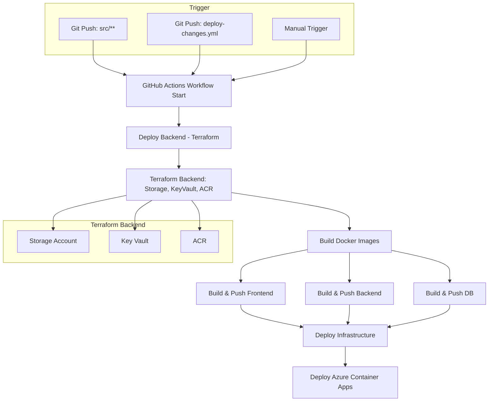
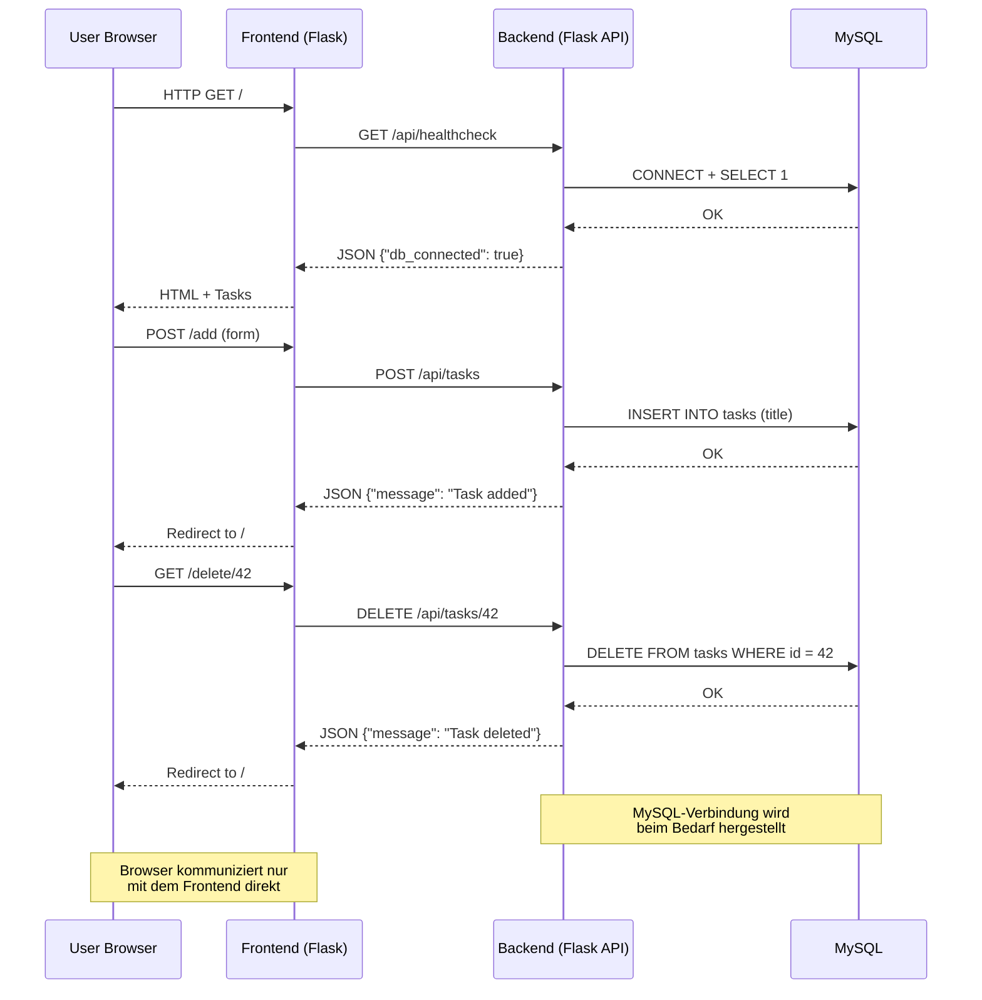

# Modul 300 - Plattformübergreifende Dienste in ein Netzwerk integrieren

## Inhaltsverzeichnis

1. [Modul 300 - Plattformübergreifende Dienste in ein Netzwerk integrieren](#modul-300---plattformübergreifende-dienste-in-ein-netzwerk-integrieren)
   1. [Inhaltsverzeichnis](#inhaltsverzeichnis)
2. [1. Projektbeschreibung und Ziel](#1-projektbeschreibung-und-ziel)
   1. [1.1 Technische Anforderungen](#11-technische-anforderungen)
   2. [1.2 Wichtige technische Aspekte](#12-wichtige-technische-aspekte)
      1. [1.2.1 Effizienz (Rechenleistung und Kosten)](#121-effizienz-rechenleistung-und-kosten)
      2. [1.2.2 Sicherheit](#122-sicherheit)
      3. [1.2.3 Flexibilität](#123-flexibilität)
   3. [1.3 Auswahl der Technologien und Gründe](#13-auswahl-der-technologien-und-gründe)
      1. [1.3.1 Container-Plattform](#131-container-plattform)
      2. [1.3.2 Infrastructure as Code](#132-infrastructure-as-code)
      3. [1.3.3 Web-Framework](#133-web-framework)
      4. [1.3.4 Datenbank](#134-datenbank)
      5. [1.3.5 CI/CD-System](#135-cicd-system)
      6. [1.3.6 Container Registry](#136-container-registry)
      7. [1.3.7 Secrets Management](#137-secrets-management)
   4. [1.4 Wirtschaftliche Überlegungen](#14-wirtschaftliche-überlegungen)
   5. [1.5 Auswahl des Cloud-Anbieters](#15-auswahl-des-cloud-anbieters)
   6. [1.6 Unterschiede zwischen IaC und Konfigurationsmanagement](#16-unterschiede-zwischen-iac-und-konfigurationsmanagement)
3. [2. Integrationskonzept \& Entscheidung](#2-integrationskonzept--entscheidung)
   1. [2.1 Systemarchitektur](#21-systemarchitektur)
   2. [2.2 Netzwerkdesign](#22-netzwerkdesign)
   3. [2.3 Werkzeuge und Entwicklung](#23-werkzeuge-und-entwicklung)
   4. [2.4 Testkonzept](#24-testkonzept)
   5. [2.5 Preisberechnung](#25-preisberechnung)
4. [3. Konfiguration](#3-konfiguration)
   1. [3.1 Secrets Management](#31-secrets-management)
   2. [3.2 Service-Optimierung](#32-service-optimierung)
      1. [3.2.1 Performance](#321-performance)
      2. [3.2.2 Sicherheit](#322-sicherheit)
      3. [3.2.3 Ressourcenverbrauch](#323-ressourcenverbrauch)
   3. [3.3 Konfigurationsmanagement](#33-konfigurationsmanagement)
   4. [3.4 Datenmigration und Changemanagement](#34-datenmigration-und-changemanagement)
      1. [3.4.1 Database Initialization](#341-database-initialization)
      2. [3.4.2 Version Control](#342-version-control)
      3. [3.4.3 Rollback-Mechanismus](#343-rollback-mechanismus)
   5. [3.5 Struktur der Terraform-Deployments](#35-struktur-der-terraform-deployments)
5. [4. Netzwerkkonfiguration](#4-netzwerkkonfiguration)
   1. [4.1 Azure Container Apps Networking](#41-azure-container-apps-networking)
   2. [4.2 Service Connectivity](#42-service-connectivity)
   3. [4.3 Netzwerk-Segmentierung](#43-netzwerk-segmentierung)
   4. [4.4 Konnektivitätstests](#44-konnektivitätstests)
   5. [4.5 Netzwerkplanung](#45-netzwerkplanung)
6. [5. Service Integration](#5-service-integration)
   1. [5.1 Microservices-Architektur](#51-microservices-architektur)
   2. [5.2 API-Schnittstellen](#52-api-schnittstellen)
   3. [5.3 CI/CD-Pipeline](#53-cicd-pipeline)
   4. [5.4 Datenfluss und API-Kommunikation](#54-datenfluss-und-api-kommunikation)
7. [7. Fehleranalyse \& Troubleshooting](#7-fehleranalyse--troubleshooting)
   1. [7.1 Logging-Strategie](#71-logging-strategie)
   2. [7.2 Systematische Fehlerbehandlung](#72-systematische-fehlerbehandlung)
   3. [7.3 Terraform-Fehlerbehandlung](#73-terraform-fehlerbehandlung)
8. [8. Deployment](#8-deployment)
   1. [8.1 Automatisches Deployment](#81-automatisches-deployment)
   2. [8.2 Manuelle Entwicklung](#82-manuelle-entwicklung)
   3. [8.3 Live-System](#83-live-system)
9. [9. Sicherheitskonzept](#9-sicherheitskonzept)
   1. [9.1 Secrets Management](#91-secrets-management)
   2. [9.2 Netzwerksicherheit](#92-netzwerksicherheit)
   3. [9.3 Zugriffskontrolle](#93-zugriffskontrolle)
10. [10. Backup und Restore](#10-backup-und-restore)
11. [11. Monitoring und Alerting](#11-monitoring-und-alerting)
12. [12. Systemvisualisierung](#12-systemvisualisierung)
    1. [13.1 Netzwerkarchitektur](#131-netzwerkarchitektur)
    2. [13.2 CI/CD Pipeline Prozess](#132-cicd-pipeline-prozess)
    3. [13.3 Datenfluss und API-Kommunikation](#133-datenfluss-und-api-kommunikation)

# 1. Projektbeschreibung und Ziel

Das Projekt ist eine containerisierte Todo-Anwendung mit einer 3-Tier-Architektur. Die Anwendung wird mit Azure Container Apps betrieben. Eine CI/CD-Pipeline sorgt für die automatische Bereitstellung. Die Infrastruktur wird mit Terraform als Code beschrieben.

## 1.1 Technische Anforderungen

Die Anwendung verwendet eine Microservices-Architektur, um einzelne Teile getrennt entwickeln und betreiben zu können. Container sorgen für einheitliche Umgebungen. Die Infrastruktur wird automatisiert aufgebaut. Neue Versionen der Anwendung werden nach jedem Git-Push oder durch manuelles Auslösen automatisch veröffentlicht.

## 1.2 Wichtige technische Aspekte

### 1.2.1 Effizienz (Rechenleistung und Kosten)

Die Container haben feste CPU- und Speichergrenzen (z. B. 0.5 CPU, 1 Gi RAM). Es werden schlanke Container-Images verwendet (z. B. `python:3.11-slim`). Azure Container Apps nutzt ein nutzungsbasiertes Abrechnungsmodell. In unserem Fall läuft die Anwendung rund um die Uhr, daher wurden die Container so effizient wie möglich gebaut.

### 1.2.2 Sicherheit

Zugangsdaten und andere sensible Informationen werden im Azure Key Vault gespeichert. Die Container befinden sich in privaten Netzwerken. Dienste authentifizieren sich über verwaltete Identitäten. Berechtigungen werden nach dem Least-Privilege-Prinzip vergeben. Zusätzlich werden Secrets auch in GitHub gespeichert und über die CI/CD-Pipeline verteilt.

### 1.2.3 Flexibilität

Die Infrastruktur wird mit Terraform als Code beschrieben. Dadurch ist sie leicht anpassbar und wiederverwendbar. Durch Containerisierung ist die Anwendung nicht an eine bestimmte Umgebung gebunden. Es werden mehrere Umgebungen wie Test und Produktion unterstützt.

## 1.3 Auswahl der Technologien und Gründe

### 1.3.1 Container-Plattform

**Ausgewählt**: Azure Container Apps
**Alternativen**: Azure Kubernetes Service (AKS), Azure Container Instances (ACI)
**Gründe**: Keine Cluster-Verwaltung notwendig. Automatisches Skalieren ist eingebaut. Abrechnung nur bei aktiver Nutzung.

### 1.3.2 Infrastructure as Code

**Ausgewählt**: Terraform
**Alternativen**: ARM Templates, Azure Bicep
**Gründe**: Plattformunabhängig. Infrastruktur-Zustand wird gespeichert. Klare Syntax. Module wiederverwendbar. Grosse Community.

### 1.3.3 Web-Framework

**Ausgewählt**: Python Flask
**Alternativen**: Node.js Express
**Gründe**: Leichtgewichtig. Schneller Einstieg. Gute Container-Kompatibilität. Grosse Bibliotheksauswahl.

### 1.3.4 Datenbank

**Ausgewählt**: MySQL
**Alternativen**: PostgreSQL, Azure SQL
**Gründe**: Weit verbreitet. Gute Docker-Integration. Ausreichend für CRUD-Anwendungen. Open Source. Einfach lokal nutzbar.

### 1.3.5 CI/CD-System

**Ausgewählt**: GitHub Actions
**Alternativen**: Azure DevOps
**Gründe**: Direkte GitHub-Integration. YAML-basierte Workflows. Gute Azure-Kompatibilität. Viele fertige Actions verfügbar.

### 1.3.6 Container Registry

**Ausgewählt**: Azure Container Registry
**Alternativen**: Docker Hub, GitHub Container Registry, AWS ECR
**Gründe**: Gut in Azure integriert. Zugriff über Azure AD steuerbar. Keine eigene Infrastruktur nötig. Gute Performance.

### 1.3.7 Secrets Management

**Ausgewählt**: Azure Key Vault
**Alternativen**: HashiCorp Vault, Kubernetes Secrets, Umgebungsvariablen
**Gründe**: Unterstützt Sicherheitsstandards. Schlüssel sind hardwaregesichert. Gute Azure-Integration. Protokollierung vorhanden. Kein eigener Betrieb notwendig.

## 1.4 Wirtschaftliche Überlegungen

Die Anwendung nutzt Dienste mit nutzungsbasierter Abrechnung. Der Betrieb ist dadurch kosteneffizient, besonders bei geringer Last. Automatisches Skalieren verhindert Überbereitstellung. Durch Managed Services ist weniger Wartung nötig. Die Architektur ist einfach gehalten, was Schulungs- und Verwaltungsaufwand reduziert.

## 1.5 Auswahl des Cloud-Anbieters

**Ausgewählt**: Microsoft Azure
**Alternativen**: AWS, Google Cloud
**Gründe**: Es wurde bewusst ein anderer Anbieter als AWS gewählt. Azure bietet moderne Dienste wie Container Apps. Gute Integration mit Microsoft-Produkten. Azure-Kenntnisse ergänzen vorhandenes Wissen.

## 1.6 Unterschiede zwischen IaC und Konfigurationsmanagement

**Ausgewählt**: Terraform
**Alternativen**: Ansible
**Gründe**: Terraform stellt Infrastruktur bereit („Was wird erstellt?“), während Tools wie Ansible Konfiguration übernehmen („Wie wird es eingerichtet?“). Terraform arbeitet deklarativ, erkennt Zustandsänderungen und zeigt geplante Änderungen vorab an.

---

# 2. Integrationskonzept & Entscheidung

## 2.1 Systemarchitektur

Die Anwendung besteht aus drei getrennten Komponenten, die zusammen eine Microservices-Architektur bilden. Das Frontend ist eine Weboberfläche, die mit Python Flask umgesetzt ist und auf Port 8080 läuft. Das Backend ist ebenfalls ein Flask-Service, der eine REST-API bereitstellt und auf Port 5000 erreichbar ist. Die Datenbank ist ein MySQL-Container, der auf Port 3306 läuft. Diese drei Teile laufen in eigenen Containern und können unabhängig voneinander entwickelt, getestet und aktualisiert werden.

Für die Umsetzung wird ein moderner Technologie-Stack verwendet. Die Containerisierung erfolgt mit Docker, besonders für die lokale Entwicklung. Für den Betrieb in der Cloud wird Azure Container Apps verwendet. Die Infrastruktur wird mit Terraform verwaltet. Für den automatisierten Aufbau und das Deployment der Anwendung kommt GitHub Actions zum Einsatz. Die Container-Images werden in der Azure Container Registry gespeichert. Die gesamte Anwendung läuft in der Microsoft Azure Cloud.

## 2.2 Netzwerkdesign

Das Frontend ist öffentlich über das Internet erreichbar. Es empfängt Anfragen von Nutzern und leitet sie intern an das Backend weiter. Das Backend verarbeitet die Anfragen und greift auf die Datenbank zu, um Daten zu lesen oder zu speichern. Das Backend und die Datenbank sind über ein privates Container-Netzwerk miteinander verbunden und nicht direkt von aussen erreichbar. Nur das Frontend hat einen öffentlichen Zugangspunkt. Dadurch wird die Sicherheit erhöht, da nur der Teil der Anwendung offen zugänglich ist, der es auch wirklich sein muss.

## 2.3 Werkzeuge und Entwicklung

Alle Services werden in eigenen Docker-Containern betrieben. Die entsprechenden Dockerfiles liegen im Projektordner. Die Infrastruktur wird vollständig mit Terraform aufgebaut, in Modulen organisiert und über Versionskontrolle verwaltet. Änderungen an Code oder Infrastruktur lösen automatisch einen GitHub Actions Workflow aus. Dabei werden Container gebaut, getestet und in die Azure-Umgebung ausgeliefert. Auf Wunsch kann der Prozess auch manuell ausgelöst werden. So ist sichergestellt, dass jede Änderung reproduzierbar und nachvollziehbar ist.

## 2.4 Testkonzept

Für die Infrastruktur gibt es automatisierte Tests innerhalb der CI/CD-Pipeline. Mit `terraform validate` wird geprüft, ob die Terraform-Konfiguration korrekt ist. Mit `terraform plan` wird vor dem Ausführen angezeigt, welche Änderungen vorgenommen würden. Bestehende Ressourcen können über Terraform Import getestet werden, um Fehler beim Abgleich zu vermeiden.

Für die Anwendung selbst gibt es Health-Check-Endpunkte wie `/api/healthcheck`, über die geprüft wird, ob der Service erreichbar ist. Beim Bauen der Container werden automatische Tests durchgeführt, um sicherzustellen, dass die Images funktionieren. Auch beim Deployment gibt es Mechanismen, die den Vorgang bei Fehlern wiederholen, um vorübergehende Probleme abzufangen.

## 2.5 Preisberechnung

todo todo todo todo todo todo todo todo todo todo todo todo todo todo todo todo todo todo todo todo todo todo todo todo todo todo todo todo todo todo todo todo todo todo todo todo todo todo todo todo todo todo todo todo todo

---

# 3. Konfiguration

## 3.1 Secrets Management
- Azure Key Vault für sensitive Daten (DB-Passwörter, ACR-Credentials)
- Environment Variables für Container-Konfiguration
- Trennung von Secrets und Code

## 3.2 Service-Optimierung

### 3.2.1 Performance
- Container Resource Limits (0.5 CPU, 1Gi Memory)
- Effiziente Base Images (python:3.11-slim)

### 3.2.2 Sicherheit
- Private Container Networks
- Managed Identities

### 3.2.3 Ressourcenverbrauch
- Optimierte Container Images
- Resource Quotas

## 3.3 Konfigurationsmanagement
- Zentrale Variablen in [`terraform.tfvars`](src/terraform/infrastructure/variables.tf)
- Umgebungsprofile für verschiedene Deployment-Stages
- Automatische Secret-Injection aus Key Vault ([Key Vault Setup](src/terraform/storage/main.tf))

## 3.4 Datenmigration und Changemanagement

### 3.4.1 Database Initialization
- Automatische Schema-Erstellung via [`init.sql`](src/docker/db/init.sql)

### 3.4.2 Version Control
- Container Image Versioning mit Tags
- Infrastructure Drift Detection mit Terraform Plan

### 3.4.3 Rollback-Mechanismus
- Previous Container Images verfügbar in ACR
- Terraform State History

Danke für die Klarstellung – ich habe deine Information in den Fliesstext integriert und **Abschnitt 3.5** hinzugefügt, der die Struktur und den Zweck der zwei separaten Terraform-Deployments beschreibt, inklusive des Imports im Storage-Deployment.

## 3.5 Struktur der Terraform-Deployments

Für die Bereitstellung der Infrastruktur wurden zwei getrennte Terraform-Projekte eingerichtet: eines für die Storage-Umgebung und eines für die restliche Infrastruktur.

Das **erste Deployment** ist für die grundlegende Storage-Umgebung zuständig. Dazu gehören:

* der **Azure Key Vault** für Secrets,
* der **Azure Container Registry (ACR)** für Container-Images und
* ein **Azure Storage Account**, der später für das Terraform-Backend genutzt wird.

Dieses Storage-Deployment wird immer **ohne Terraform-Backend** ausgeführt, da der Storage Account für das Backend zu diesem Zeitpunkt noch nicht existiert. Stattdessen werden alle benötigten Ressourcen vor dem `terraform apply` über `terraform import` in die Pipeline geladen. Diese Imports werden im CI/CD-Workflow ausgeführt. Sie betreffen z. B. die Ressourcengruppe, den Storage Account selbst, die ACR und die gespeicherten Secrets im Key Vault. Der Zustand wird also nicht in einer `.tfstate`-Datei gespeichert, sondern immer direkt vor der Ausführung neu hergestellt.

Sobald die Storage-Ressourcen bereitstehen, kann das **zweite Deployment** (die Infrastruktur für Container, Apps und Netzwerke) ausgeführt werden. Dieses verwendet dann den zuvor erstellten Storage Account als **Remote Backend** für die Terraform-Zustandsdateien. Dazu wird beim `terraform init` der Pfad zum Storage-Container über `-backend-config` angegeben. Die Datei `infrastructure.tfstate` wird dort abgelegt und ermöglicht eine dauerhafte und teamübergreifende Zustandsverwaltung.

Durch diese Trennung wird das Problem umgangen, dass Terraform kein Remote-Backend verwenden kann, bevor der zugehörige Storage Account existiert. Gleichzeitig wird sichergestellt, dass der Aufbau reproduzierbar und automatisiert bleibt, ohne lokale Zustandsdateien verwenden zu müssen.

---

# 4. Netzwerkkonfiguration

## 4.1 Azure Container Apps Networking

Alle Container laufen innerhalb einer gemeinsamen **Container App Environment**. Diese Umgebung stellt ein privates virtuelles Netzwerk bereit, über das die einzelnen Services miteinander kommunizieren können. Die interne Kommunikation zwischen den Containern erfolgt dabei über die Container-Namen, zum Beispiel `${var.project_name}-backend` für das Backend oder `${var.project_name}-db` für die Datenbank. Nur das Frontend ist von aussen erreichbar. Dafür wird `external_enabled = true` gesetzt, sodass ein öffentlicher Endpoint über Azure bereitgestellt wird. Alle anderen Komponenten wie Backend und Datenbank bleiben intern und sind nicht direkt aus dem Internet zugänglich.

## 4.2 Service Connectivity

Für jeden Service ist die Netzwerkkonfiguration individuell festgelegt. Das **Frontend** ist öffentlich erreichbar, da es die Benutzeroberfläche bereitstellt. Im Terraform-Code wird das über folgenden Block geregelt:

```hcl
ingress {
  external_enabled = true
  target_port      = 8080
  transport        = "auto"
}
```

Das **Backend** ist nur intern über das private Container-Netzwerk erreichbar. Es nimmt Anfragen vom Frontend entgegen und verarbeitet sie weiter:

```hcl
ingress {
  external_enabled = false
  target_port      = 5000
  transport        = "tcp"
}
```

Auch die **Datenbank** ist nur intern erreichbar. Sie kann ausschliesslich vom Backend angesprochen werden:

```hcl
ingress {
  external_enabled = false
  target_port      = 3306
  transport        = "tcp"
}
```

## 4.3 Netzwerk-Segmentierung

Die Dienste sind logisch voneinander getrennt, aber innerhalb der Container App Environment miteinander verbunden. Das Frontend kommuniziert über HTTP mit dem Backend, das über den Namen `${var.project_name}-backend` erreichbar ist. Das Backend wiederum stellt die Verbindung zur MySQL-Datenbank über `${var.project_name}-db` her. Von aussen ist nur das Frontend erreichbar, alle anderen Komponenten sind abgeschottet und geschützt. Diese Trennung reduziert die Angriffsfläche und erhöht die Sicherheit.

## 4.4 Konnektivitätstests

Zur Überprüfung der Verbindungen werden **Health-Check-Endpunkte** in der Anwendung bereitgestellt, zum Beispiel unter `/api/healthcheck`. Diese ermöglichen eine einfache Prüfung, ob ein Service intern erreichbar und funktionsfähig ist. Zusätzlich sind **Retry-Mechanismen** in die Deployments eingebaut, um temporäre Verbindungsprobleme beim Start abzufangen. In Terraform wird über `depends_on` definiert, welche Services voneinander abhängig sind, damit sie in der richtigen Reihenfolge erstellt und verbunden werden.

## 4.5 Netzwerkplanung

Die Netzwerkstruktur ist so aufgebaut, dass das Frontend öffentlich über das Internet erreichbar ist, aber alle anderen Komponenten nur intern kommunizieren. Das folgende Schema zeigt den Aufbau:


Die Struktur trennt öffentliche und interne Netzwerke klar voneinander. Externe Nutzer erreichen nur das Frontend, während alle weiteren Verbindungen innerhalb der privaten Umgebung ablaufen.

---

# 5. Service Integration

## 5.1 Microservices-Architektur

Die Anwendung folgt einer Microservices-Architektur, bei der jede Komponente als eigenständiger Service in einem separaten Container ausgeführt wird. Das betrifft das Frontend, das Backend sowie die Datenbank. Die Kommunikation zwischen den Services erfolgt über eine REST API mit JSON als Datenformat. Die Dienste sind innerhalb der Azure Container Apps Umgebung über ihre Container-Namen als Hostnamen erreichbar. Dadurch ist keine externe Service-Discovery notwendig.

## 5.2 API-Schnittstellen

Die zentrale Schnittstelle für die Aufgabenverwaltung wird vom Backend bereitgestellt. Die API unterstützt mehrere Endpunkte:

* `GET /api/tasks` – gibt alle bestehenden Tasks zurück
* `POST /api/tasks` – legt einen neuen Task an
* `DELETE /api/tasks/<id>` – löscht einen bestimmten Task
* `GET /api/healthcheck` – prüft die Erreichbarkeit und Datenbankverbindung

Alle Endpunkte liefern JSON-Antworten und werden vom Frontend konsumiert. Das Frontend stellt selbst keine eigene API zur Verfügung, sondern dient als Nutzeroberfläche, die mit dem Backend über HTTP kommuniziert.

## 5.3 CI/CD-Pipeline

Die Bereitstellung der Anwendung ist vollständig automatisiert über GitHub Actions umgesetzt. Die CI/CD-Pipeline startet entweder bei einem Push auf den Branch `main`, bei Änderungen an den Quelldateien oder manuell über `workflow_dispatch`. Der Prozess ist in mehrere Phasen unterteilt:

1. **Trigger**: Start durch Git-Push oder manuellen Auslöser
2. **Deploy Backend**: Ausführen von Terraform für die Storage-Komponenten
3. **Build**: Erstellen und Pushen der Docker-Images für Frontend, Backend und Datenbank
4. **Deploy Infrastruktur**: Ausrollen der restlichen Azure-Ressourcen und Dienste
5. **Bereitstellung**: Deployment der Container auf Azure Container Apps

Die Images werden dabei stets mit dem Tag `latest` versehen und in die Azure Container Registry (ACR) hochgeladen. Der Ablauf ist im Folgenden als Diagramm dargestellt:



## 5.4 Datenfluss und API-Kommunikation

Die Interaktion zwischen Benutzer, Frontend, Backend und Datenbank folgt einem klaren Ablauf. Der Browser kommuniziert ausschliesslich mit dem Frontend. Dieses leitet Anfragen an das Backend weiter, das wiederum mit der Datenbank verbunden ist. Beispielsweise wird bei einem Seitenaufruf zuerst ein Healthcheck durchgeführt. Danach lädt das Frontend die aktuellen Aufgaben über die API. Neue Aufgaben oder Löschaktionen werden ebenfalls vom Frontend über die API an das Backend gesendet. Das Backend übernimmt die Kommunikation mit der Datenbank und gibt die Ergebnisse an das Frontend zurück.

Das folgende Sequenzdiagramm zeigt den Ablauf im Detail:



Der Datenfluss ist so aufgebaut, dass alle internen Verbindungen über das private Container-Netzwerk laufen. Es gibt keinen direkten Zugriff auf Backend oder Datenbank von aussen. Dies unterstützt die Trennung der Schichten und erhöht die Sicherheit.

---

# 7. Fehleranalyse & Troubleshooting

## 7.1 Logging-Strategie

In der Anwendung wird eine zentrale Logging-Konfiguration verwendet, die im Backend (`src/docker/backend/app.py`) direkt beim Start eingerichtet wird. Es wird mit dem Modul `logging` gearbeitet. Die Ausgaben enthalten Zeitstempel, Log-Level (z. B. INFO, ERROR) und die eigentliche Nachricht. Dadurch können Logs im Terminal oder in Cloud-Diensten wie Azure Monitor strukturiert ausgewertet werden. Für alle Services – auch im Frontend – erfolgt die Ausgabe auf der Konsole, was den Zugriff über `docker logs` oder Azure-Logstreams erleichtert.

Beispielhafte Konfiguration:

```python
logging.basicConfig(
    level=logging.INFO,
    format='%(asctime)s [%(levelname)s] %(message)s',
    handlers=[logging.StreamHandler()]
)
```

## 7.2 Systematische Fehlerbehandlung

Fehler werden systematisch behandelt und in drei Hauptkategorien unterteilt:

* **Connection Errors**: Fehler beim Verbindungsaufbau, etwa zwischen Backend und Datenbank
* **Application Errors**: Probleme in der Anwendungslogik, z. B. fehlende Eingaben oder SQL-Fehler
* **Infrastructure Errors**: Fehler bei Azure-Ressourcen, z. B. fehlende Key Vault Secrets oder falsche Deployments

Um Ausfälle oder Verbindungsprobleme abzufangen, setzen sowohl Backend als auch Frontend auf **Retry-Mechanismen** mit automatischem Wiederholversuch. Bei einem Fehler wird zunächst eine kurze Pause eingelegt (z. B. 2 Sekunden), bevor erneut versucht wird, die Verbindung aufzubauen. Dadurch können z. B. temporäre Netzwerkprobleme oder langsames Hochfahren von Diensten überbrückt werden. Im Backend passiert dies in der `get_connection()`-Funktion, im Frontend über eigene `*_with_retries()`-Funktionen für `GET`, `POST` und `DELETE`.

Zusätzlich wird **Graceful Degradation** umgesetzt. Wenn das Backend nicht erreichbar ist, wird dem Benutzer eine passende Fehlermeldung angezeigt. Die Anwendung bleibt dabei weiterhin nutzbar, auch wenn manche Funktionen (z. B. Datenanzeige) ausfallen. Das Frontend prüft dafür regelmäßig über `/api/healthcheck`, ob das Backend läuft und die Datenbank erreichbar ist. Diese Prüfung erfolgt sowohl beim Start als auch bei jeder Benutzeraktion.

## 7.3 Terraform-Fehlerbehandlung

Auch die Infrastruktur wird auf Fehler geprüft, bevor Änderungen durchgeführt werden. Im CI/CD-Workflow wird vor dem `terraform apply` immer ein `terraform validate` und `terraform plan` ausgeführt. `validate` prüft die Syntax und Struktur der Terraform-Konfiguration, während `plan` eine Vorschau der geplanten Änderungen liefert. Fehler wie ungültige Konfigurationen oder fehlende Abhängigkeiten werden dadurch frühzeitig erkannt.

Beispiel:

```yaml
- name: Terraform Validate
  working-directory: ./src/terraform/storage
  run: terraform validate

- name: Terraform Plan
  working-directory: ./src/terraform/storage
  run: terraform plan -out=tfplan
```

Bei Bedarf wird der komplette Infrastrukturzustand vor jedem Deployment erneut über `terraform import` hergestellt, z. B. für Key Vault, ACR oder den Storage Account. Das macht das System robuster gegen State-Verlust oder fehlende Ressourcen im Backend.

---

# 8. Deployment

## 8.1 Automatisches Deployment

Die Anwendung wird automatisch bereitgestellt, sobald ein Push auf den `main`-Branch erfolgt. Dieser Push löst über GitHub Actions den vollständigen CI/CD-Prozess aus. Dabei laufen mehrere Schritte nacheinander ab: Zuerst wird die Infrastruktur für den Terraform-Backend-Bereich (Storage Account, Key Vault, ACR) importiert und bei Bedarf aktualisiert. Danach werden die Container-Images für Frontend, Backend und Datenbank gebaut und mit dem Tag `latest` in die Azure Container Registry gepusht. Im letzten Schritt wird die restliche Infrastruktur (z. B. Azure Container Apps) mit Terraform bereitgestellt und die Container werden ausgerollt.

Ein einfacher Git-Push reicht also aus, um Änderungen automatisch in das Live-System zu übertragen:

```bash
git push origin main
```

Auf dem GitHub Action report gibt es eine Step Summary, die die Frontend URL enthält.


## 8.2 Manuelle Entwicklung

Für lokale Entwicklung und Tests steht eine `docker-compose`-Umgebung zur Verfügung. Sie enthält alle notwendigen Dienste (Frontend, Backend, MySQL) in separaten Containern. Die Anwendung ist dann auf `http://localhost:8080` im Browser erreichbar. Änderungen am Code können so schnell ausprobiert werden, ohne den kompletten Cloud-Workflow durchlaufen zu müssen.

Beispiel für den Start der lokalen Umgebung:

```bash
cd src/docker
docker-compose up -d
```

Die Konfiguration ist in der Datei [`docker-compose.yml`](src/docker/docker-compose.yml) hinterlegt.

## 8.3 Live-System

Nach einem erfolgreichen Deployment in Azure wird die Anwendung unter der automatisch erzeugten Frontend-URL erreichbar gemacht. Diese URL wird über Terraform als Output ausgegeben und kann anschließend im Browser aufgerufen werden. Alle Ressourcen – Container Apps, Netzwerke, Secrets und Datenbankzugriffe – sind dann vollständig aktiv und produktionsbereit.

# 9. Sicherheitskonzept

## 9.1 Secrets Management

Die gesamte Verwaltung sensibler Informationen erfolgt über den **Azure Key Vault**. Dort werden alle Passwörter und Zugangsdaten wie Datenbank-Credentials oder Container-Registry-Authentifizierungen sicher gespeichert. In der Anwendung selbst befinden sich keine Secrets im Code oder in Konfigurationsdateien. Stattdessen werden diese Werte bei Bedarf über Umgebungsvariablen zur Laufzeit eingebunden.

Für die Kommunikation zwischen Diensten innerhalb von Azure wird auf **Managed Identities** gesetzt. Dadurch können sich Container und Infrastrukturkomponenten gegenseitig authentifizieren, ohne dass feste Zugangsdaten erforderlich sind. Das erhöht die Sicherheit und verringert das Risiko durch versehentlich veröffentlichte Zugangsdaten.

## 9.2 Netzwerksicherheit

Die Netzwerkkonfiguration folgt dem Prinzip „so wenig offen wie nötig“. Nur das **Frontend** ist öffentlich über das Internet erreichbar. Alle anderen Komponenten – wie Backend und Datenbank – sind in einem **privaten Container-Netzwerk** isoliert und nur intern erreichbar.

Auch der Zugriff auf Container-Images in der **Azure Container Registry (ACR)** ist geschützt. Hier erfolgt der Zugriff ausschließlich über Authentifizierung, z. B. per verwalteter Identität oder ACR-Zugangsdaten, die im Key Vault hinterlegt sind.

## 9.3 Zugriffskontrolle

Der Zugriff auf Ressourcen innerhalb von Azure wird über **Azure Role-Based Access Control (RBAC)** geregelt. Für automatisierte CI/CD-Prozesse wird ein eigener **Service Principal** verwendet, der über die `AZURE_CREDENTIALS`-Secrets in GitHub bereitgestellt wird. Dieser Service Principal hat nur die Berechtigungen, die für den Deployment-Prozess nötig sind.

Das gesamte Berechtigungskonzept folgt dem **Least-Privilege-Prinzip**: Jede Identität – ob menschlich oder maschinell – erhält nur genau die Rechte, die für ihre Aufgabe notwendig sind. So wird das Risiko durch Fehlkonfiguration oder Missbrauch minimiert.

# 10. Backup und Restore

todo todo todo todo todo todo todo todo todo todo todo todo todo todo todo todo todo todo todo todo todo todo todo todo todo todo todo todo todo todo todo todo todo todo todo todo todo todo todo todo todo todo todo todo todo

# 11. Monitoring und Alerting

todo todo todo todo todo todo todo todo todo todo todo todo todo todo todo todo todo todo todo todo todo todo todo todo todo todo todo todo todo todo todo todo todo todo todo todo todo todo todo todo todo todo todo todo todo

# 12. Systemvisualisierung

## 13.1 Netzwerkarchitektur


## 13.2 CI/CD Pipeline Prozess


## 13.3 Datenfluss und API-Kommunikation


